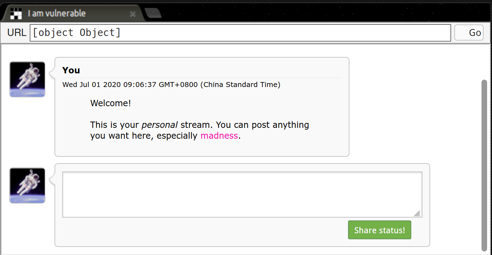
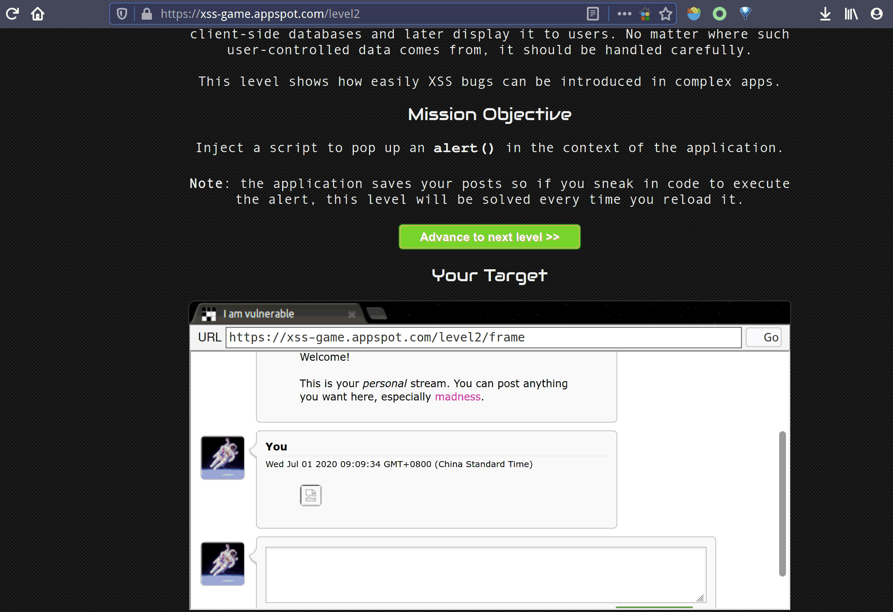
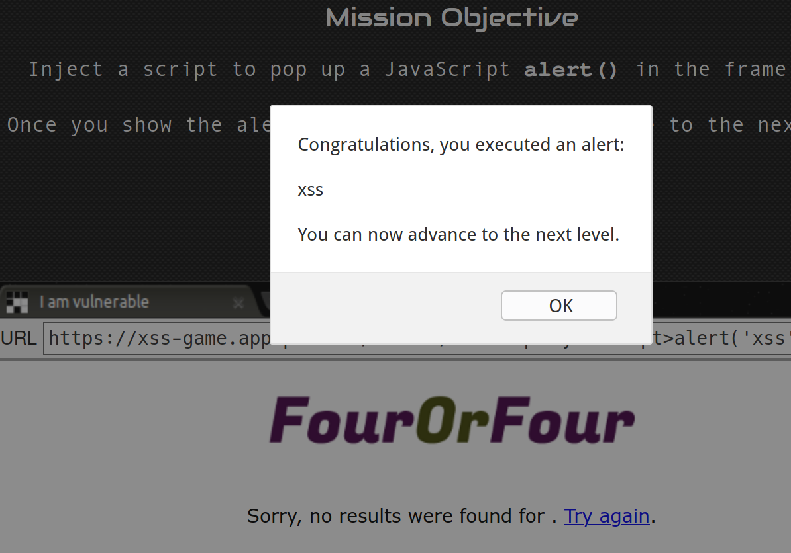
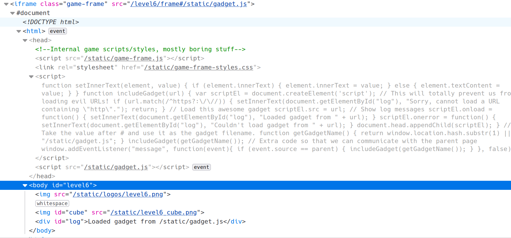
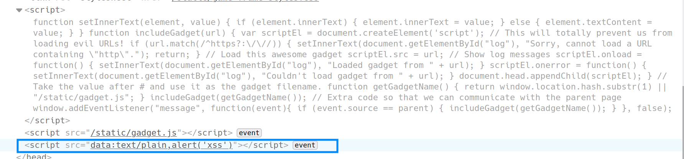
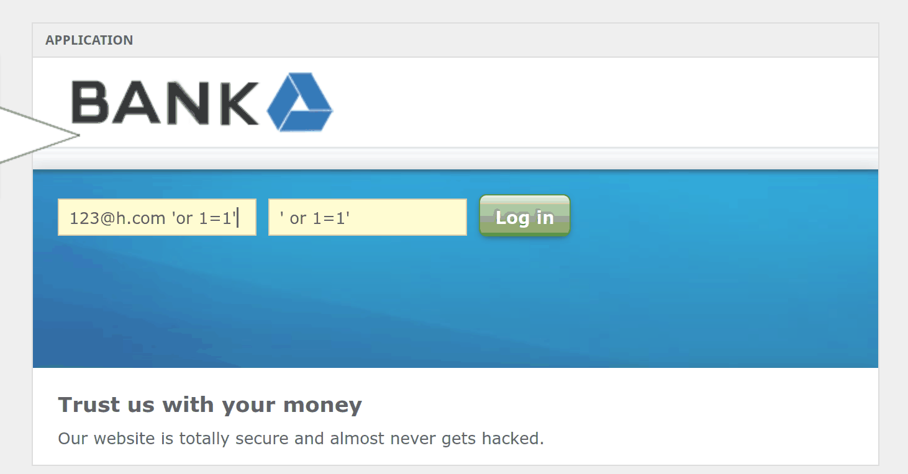

## XSS

跨站脚本攻击（Cross-site scripting，XSS）是一种安全漏洞，攻击者可以利用这种漏洞在网站上注入恶意的客户端代码。当被攻击者登陆网站时就会自动运行这些恶意代码，从而，攻击者可以突破网站的访问权限，冒充受害者。

### 类型

#### 存储型 XSS

> 注入型脚本永久存储在目标服务器上。当浏览器请求数据时，脚本从服务器上传回并执行。

常见场景 —— 留言板

如果在留言板留如下留言，由于未做任何过滤，其他所有访问到该界面的用户都将受到 xss 攻击如图。

``

#### 反射型 XSS

> 当用户点击一个恶意链接，或者提交一个表单，或者进入一个恶意网站时，注入脚本进入被攻击者的网站。Web 服务器将注入脚本，比如一个错误信息，搜索结果等 返回到用户的浏览器上。由于浏览器认为这个响应来自"可信任"的服务器，所以会执行这段脚本。

简单常见的 XSS 攻击类型。最朴实无华的攻击方式如下：

``

#### 基于 DOM 的 XSS

> DOM XSS 是由于浏览器解析机制导致的漏洞，服务器不参与，而存储型与反射型都需要服务器响应参与。

初始 url 如下，可以看出试图加载 gadget.js:

`https://xss-game.appspot.com/level6/frame#/static/gadget.js`

界面元素如下

将 url 修改为如下:

`https://xss-game.appspot.com/level6/frame#data:text/plain,alert('xss')`

发现 dom 树中出现了新元素`<script>`，实现了基于 dom 的 XSS

## SQL 注入

SQL 注入利用了无法验证用户输入的 Web 应用程序。 黑客可以通过 Web 应用程序恶意传输 SQL 命令，以由主数据库执行。

例如：

在图形界面后面输入用户名和密码后，SQL 查询的工作方式如下：

`"SELECT Count(*) FROM Users WHERE Username=' " + txt.User.Text+" ' AND Password=' "+ txt.Password.Text+" ' ";`

现在假设用户输入用户名：admin 和密码：123，然后在单击"连接"按钮后，将按以下方式执行 SQL 查询：

`"SELECT Count(*) FROM Users WHERE Username=' admin ' AND Password=' 123 ' ";`

如果凭据正确，则允许用户登录，因此这是一种非常简单（且不安全）的机制。黑客利用这种不安全性获得未经授权的访问。

黑客使用简单的 trick，例如：

username： `admin`

password： `any'or'1'='1`

单击连接按钮后，SQL 查询将按以下方式工作：

`"SELECT Count(*) FROM Users WHERE username=' admin ' AND password=' anything 'or'1'='1 ' ";`

面查询的密码部分。

`password=' anything' or '1'='1'`

密码不是`any`，因此返回 FALSE ，但是" 1" =" 1"为真返回 TRUE。 最后，由于使用 OR 运算符，值（FALSE OR TRUE）为 TRUE，因此身份验证成功绕过。

## 实验平台

[xss-game](https://xss-game.appspot.com/)

[sql-injection](https://www.hacksplaining.com/exercises/sql-injection#/after-server-error)
