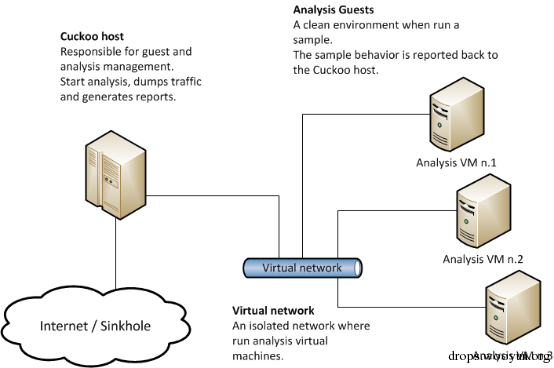
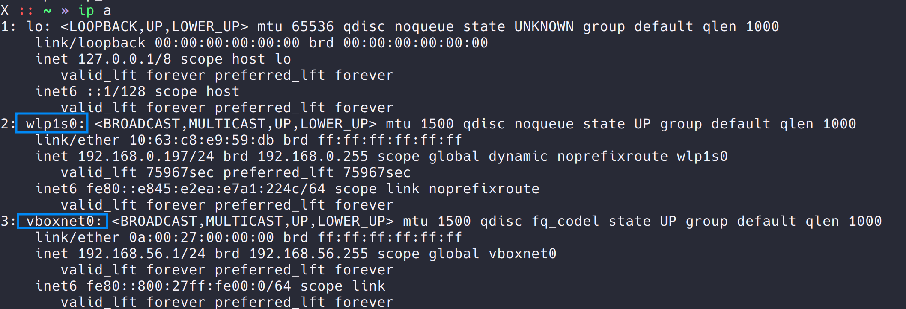
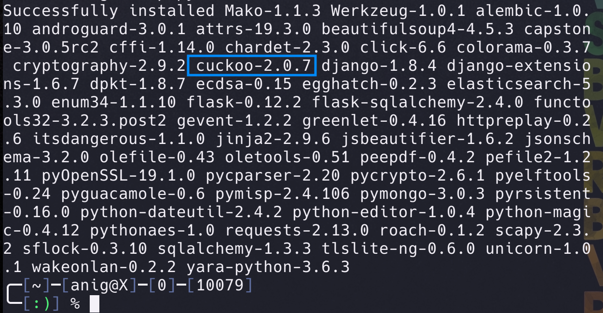
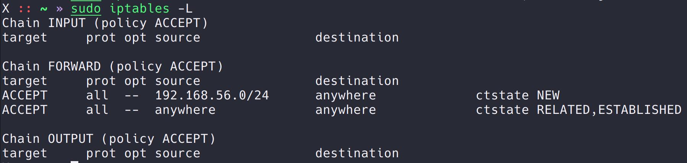
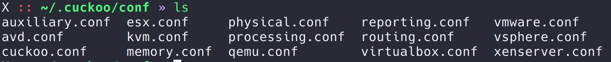
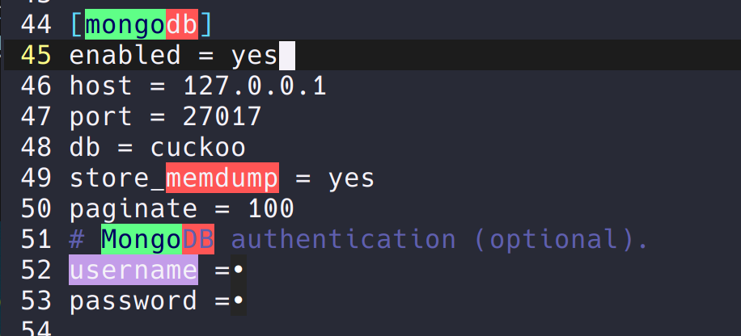
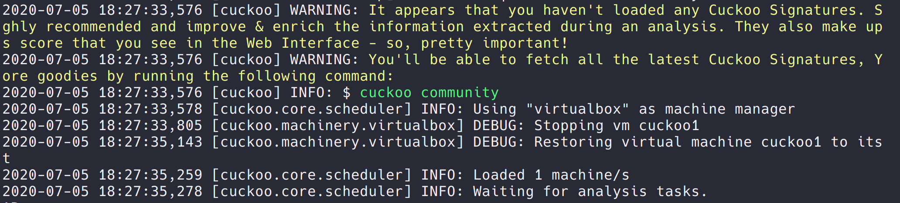
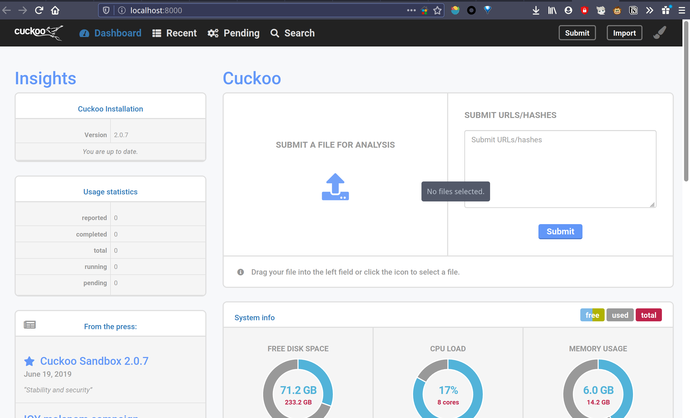
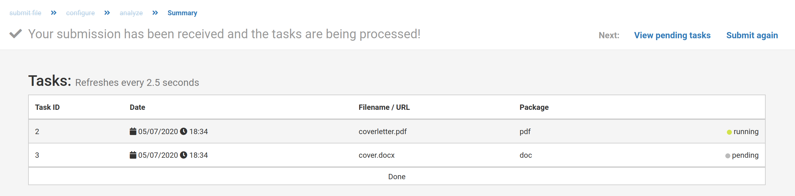

# Cuckoo 沙盒搭建及体验

## cuckoo 概述

Cuckoo 是一款开源的自动化恶意软件分析系统，目前主要用于分析 windows 平台下的恶意软件，但其框架同时支持 Linux 和 Mac OS。cuckoo 能够自动化获取如下信息：

- 能够跟踪恶意软件进程及其产生的所有进程的 win32 API 调用记录；
- 能够检测恶意软件的文件创建、删除和下载；
- 能够获取恶意软件进程的内存镜像；
- 能够获取系统全部内存镜像，方便其他工具进行进一步分析；
- 能够以 pacp 格式抓取网络数据；
- 能够抓取恶意软件运行时的截图。

Cuckoo 支持分析多种文件格式，包括 windows 可执行文件，DLL 文件，PDF 文档，Office 文档，恶意 URL，HTML 文件，PHP 文件，CPL 文件，VBS，ZIP 压缩文件，jar 文件，python 程序等。这些完全依赖于他的分析模块。

下图是 cuckoo 的架构图，非常清晰。Cuckoo 依赖于下面的虚拟机进行实际的分析，然后通过虚拟网络将分析结果传输给 cuckoo host。所以 cuckoo 的运行至少需要一个虚拟化环境。目前 cuckoo 能够支持 vmware，virtualbox，kvm，qemu，xen，avd 等主流虚拟化平台。



Cuckoo 的架构是高度模块化的，只要我们添加不同的分析模块，cuckoo 就能够完成不同系统平台下的分析工作。

## 实验内容

- 主机：Manjaro
- 虚拟机：Windows 10



### 安装

`pip2 install cuckoo`
安装完成



### 配置

Cuckoo 在运行的时候，需要在 host 上监听一个地址，用于获取报告信息，而这个地址虚拟机必须能够访问的到。这里采用的网络配置是将虚拟机网卡选择 host-only 模式，相当于虚拟机与 host 之间连接了一根网线。此时，host 的网卡列表中会有一个类似 vboxnet0 的网卡，这就是 host 与虚拟机之间通信的网卡。虚拟机内部的 ip 地址可以自己设置，只要跟 vboxnet0 的地址在一个网段即可。默认情况下 vboxnet0 是 192.168.56.1。

此次虚拟机是 192.168.56.21

为了让虚拟机能够正常的访问外网，host 还需要进行数据转发，参考官方的命令：

```bash
iptables -A FORWARD -o wlp1s0 -i vboxnet0 -s 192.168.56.0/24 -m conntrack --ctstate NEW -j ACCEPT
iptables -A FORWARD -m conntrack --ctstate ESTABLISHED,RELATED -j ACCEPT
iptables -A POSTROUTING -t nat -j MASQUERADE
sysctl -w net.ipv4.ip_forward=1
```



其中第一条命令中的 wlp1s0 是 host 的上网用的真实网卡地址，vboxnet0 则是虚拟网卡。

最后一条是开启内核数据转发。

装好虚拟机系统后，为达到最好的兼容效果，需要将 windows 虚拟机的防火墙，自动更新关闭，然后需要安装 python2.7 环境。并将 cuckoo 根目录下 agent/agent.py 复制到虚拟机中。agent.py 负责虚拟机到主机的数据传输，可以将其添加到 startup 文件夹下，开机自动启动，如果不想出现黑窗口，可以修改文件名 agent.py 到 agent.pyw。运行 agent.pyw 后，此时的虚拟机环境基本搭建完成了，当然，如果需要分析 office 或者 pdf 等，那么还需要安装这些软件。现在可以创建一个纯净的系统快照了，以备后用。

虚拟机配置完成之后，就是配置 cuckoo 了。Cuckoo 的配置文件在 conf 目录下，该目录下有很多配置文件



其中：

- auxiliary.conf 是辅助配置模块，用于辅助其他功能如 sniffer，mitm。这里可以不用配置。

- cuckoo.conf 是主要配置文件，最主要的是 machinery 用于指定我们使用的虚拟机配置文件，默认是 virtualbox，该文件同样位于 conf 目录下，名字是 virtualbox.conf。当然我们可以自己定义自己的虚拟机配置文件，并放在 conf 目录下，命名规则是一样的。另外重要的选项是 ip 和 port，用于指定接收分析结果的服务器。该地址必须能够让虚拟机访问到，一般设置为虚拟网卡的地址，比如上面配置的 vboxnet0 地址 192.168.56.1，端口默认就可以。
- memory.conf 是内存镜像配置选项，主要用于 Volatility 分析，这里可以不用配置。
- processing.conf 是结果处理配置模块，其中的配置选项直接影响最终报告的内容，这里可以不用配置。
- machinery.conf 是指所有的虚拟化配置文件，包括 virtualbox、vmware、kvm 等。这些文件属于一类文件，在实际的配置当中，我们根据我们的虚拟化环境，只需要配置其中一个即可，同时采用的这个配置文件也必须在 cuckoo.conf 的 machinery 字段指定。这里的配置选项都是针对特定虚拟化平台的，很多选项只适用于某些平台。我们采用的是 virtualbox.conf，其中 mode 指定 virtualbox 的运行模式，path 指定 VBoxManage 的绝对路径，machines 指定我们使用的虚拟机的名字，platform 指定虚拟机运行的系统平台，ip 指定虚拟机的 ip 地址。
- reporting.conf 用于配置报告生成的方式，这里可以不用配置。

最后配置一下 cuckoo 的 web 界面。需要开启 reporting.conf 中的 mongodb



然后开启 mongodb 服务：`systemctl start mongodb`

### 运行

Python cuckoo.py 运行 cuckoo 分析系统。如下图：



启动后 cuckoo 开始等待分析任务

在浏览器中打开 127.0.0.1:8000



点击 submit 添加任务，同时还有一些高级选项，如果需要内存分析，请选中 Full Memory Dump。提交后，cuckoo 就会开始自动分析，期间 virtualbox 会启动并运行程序。



