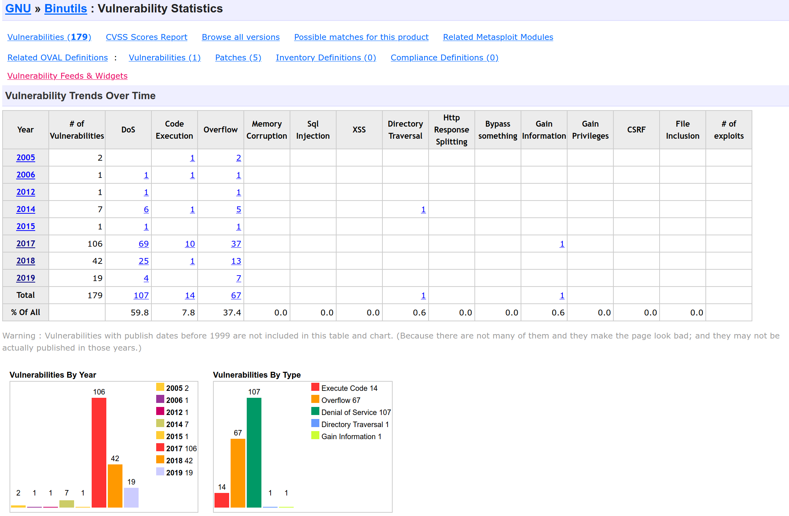
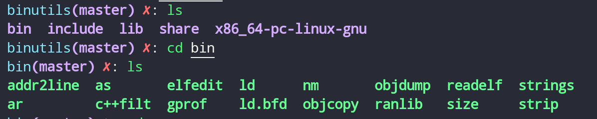
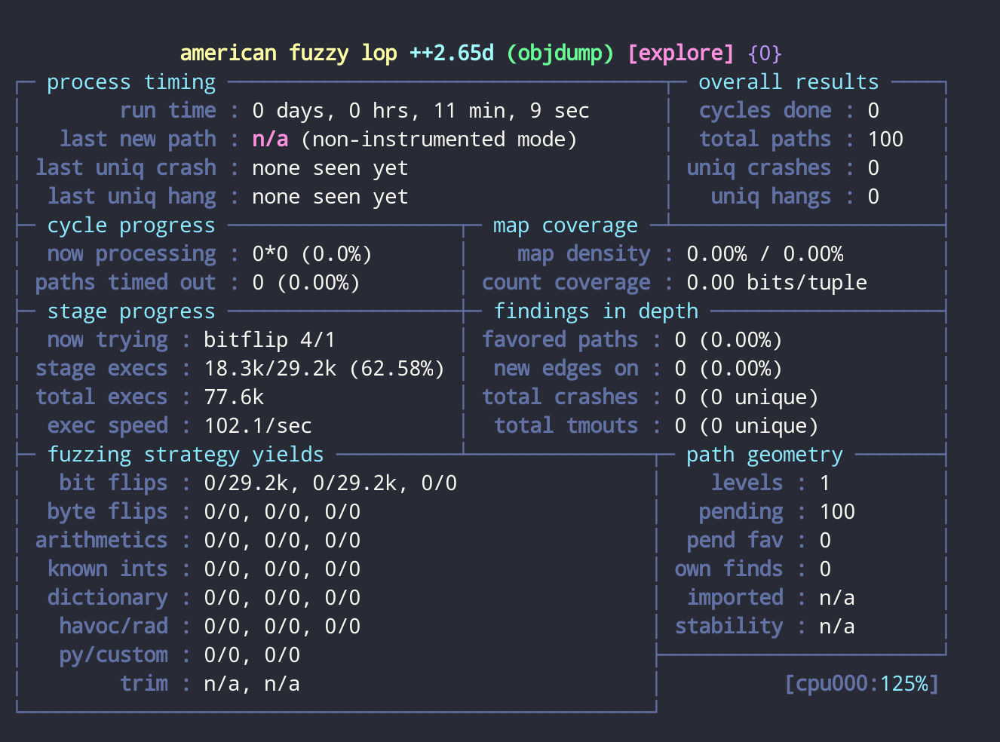

# Fuzz 实验

## 实验内容

在核心 Linux 实用程序中查找错误，使用 AFL 对 GNU binutils 工具集进行模糊测试

## 实验工具

- AFL([American Fuzzy Lop](https://github.com/google/AFL/))是由安全研究员 Micha-Zalewski 开发的一款基于覆盖引导（Coverage-guided）的模糊测试工具，它通过记录输入样本的代码覆盖率，从而调整输入样本以提高覆盖率，增加发现漏洞的概率。

## 实验步骤

### 安装 AFL

从官网下载最新版的源码（latest version），解压后进入所在目录。
执行以下命令进行编译和安装：

```shell
make
sudo make install
```

### 下载测试用例

CVE 中可以看到 gnu binutils 层出不穷。

binutils 对于 AFL 入门非常有用，因为它很简单、易设置，是一个值得摸索的目标。



```shell
$ curl -O "https://mirrors.syringanetworks.net/gnu/binutils/binutils-2.34.tar.xz"
$ tar -xvf binutils-2.34.tar.xz
$ cd binutils-2.34
$ ./configure CFLAGS="-O0" CC=afl-gcc prefix=$PWD/../binutils CXXFLAGS="-O0" CXX=afl-g++ AFL_PATH=/usr/bin/
$ AFL_PATH=/usr/bin/ make -j16 && make install
```

安装好后，可在当前目录下看到编译好的 binutils：



### 选择 seed

注意事项如下：

1. 种子文件应该是目标应用程序的有效输入文件。 虽然无效输入有时会产生有趣的错误和崩溃，但有效的输入会更快地找到更多路径。

2. 由于程序处理较小的输入文件通常花费较少的时间，因此种子文件应该很小<1kb，得到每秒更多执行。

3. 如果存在大量代码覆盖或功能重叠，则使用多个种子文件的效率可能会很低。 AFL 包括称为 AFL-cmin 和 AFL-Tmin 的语料库最小化工具，它们将减少多文件种子语料库的大小。

4. 对于常见的文件和数据格式，可使用原始`testcase\`目录下的 AFL 包含的种子文件。

### 模糊测试

要避免将崩溃误解为挂起，运行如下：

`echo core > /proc/sys/kernel/core_pattern`

开始 Fuzz

`afl-fuzz -i your_testcases -n -o out ./binutils/bin/readelf @@`


