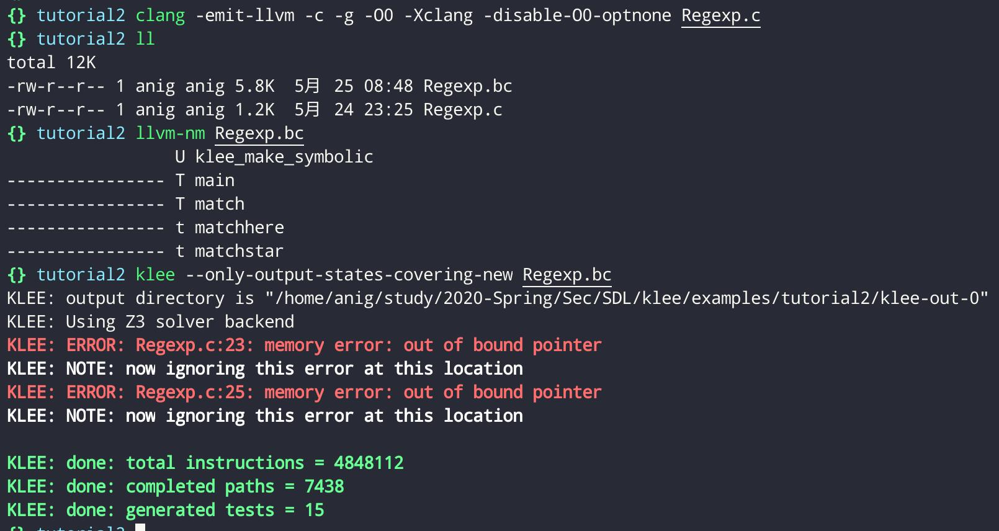
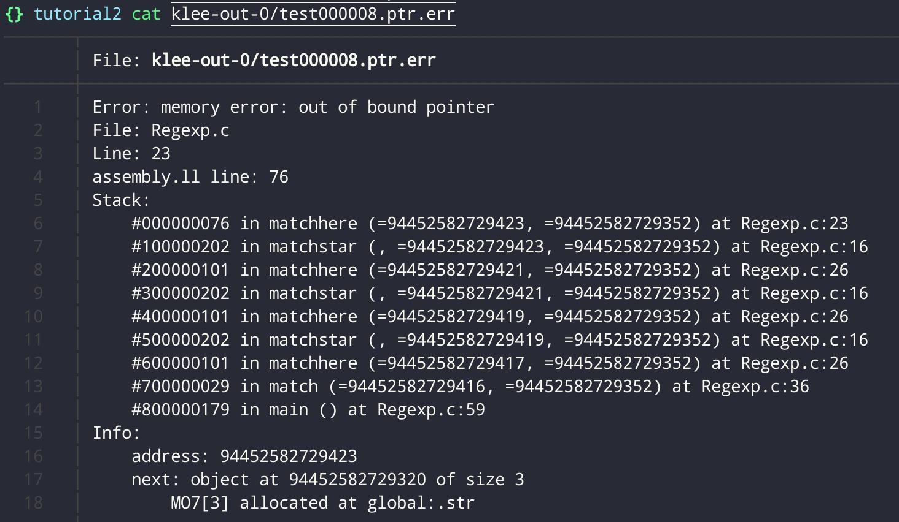
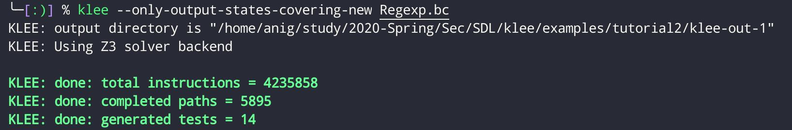
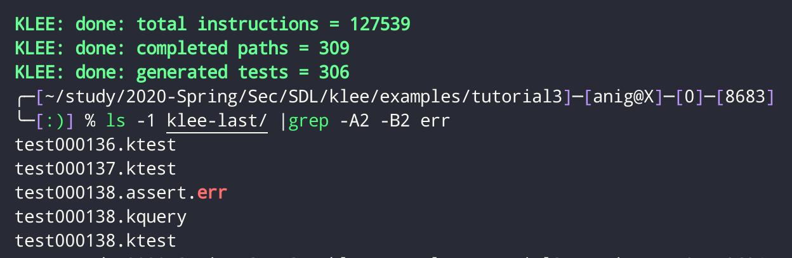
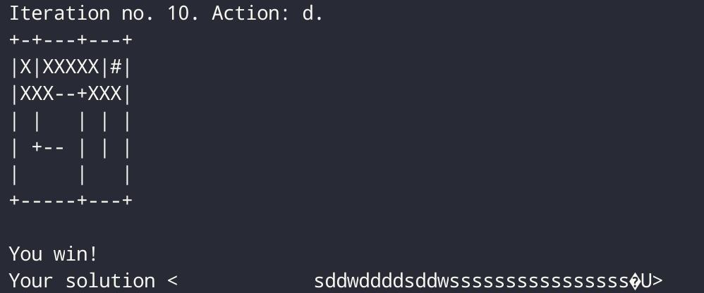
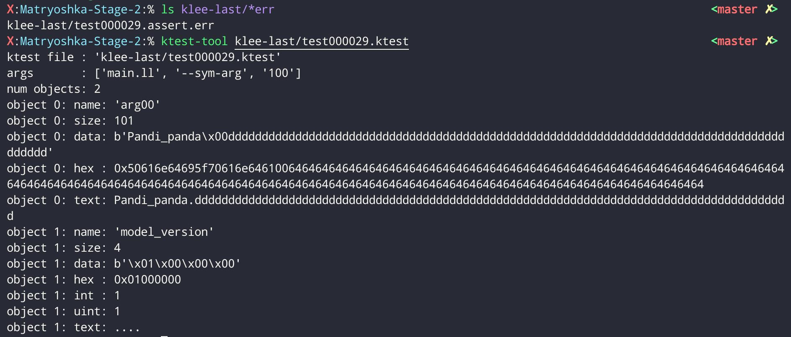
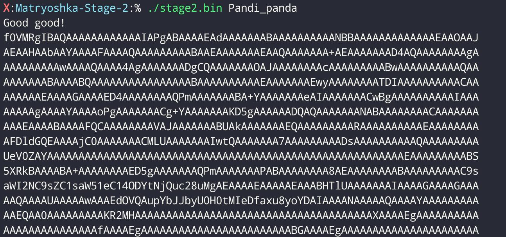

# KLEE 符号执行基础使用

## Turorial 2

```bash
# 新建对应 examples/Regexp.c 文件
# 编译
clang -emit-llvm -c -g -O0 -Xclang -disable-O0-optnone Regexp.c

# 我的 KLEE 环境已经配好了因此不需要 -I ../../include 来寻找头文件

# -c 将代码编译到目标文件（而不是本机可执行文件）
# -g 导致其他调试信息存储在目标文件中
# -O0 -Xclang -disable-O0-optnone 编译不进行任何优化，但不阻止 KLEE 进行自身的优化 （？

# 验证是否成功
llvm-nm Regexp.bc
                 U klee_make_symbolic
---------------- T main
---------------- T match
---------------- t matchhere
---------------- t matchstar

# 符号执行
klee --only-output-states-covering-new Regexp.bc
#KLEE将使用第一个空闲的klee-out-N目录，并创建一个klee-last符号链接指向最新创建的目录

# --only-output-states-covering-new 只生成覆盖新代码的状态
# 如不介意错误案例的重复，使用--emit-all-errors
```


KLEE 错误类型包括:

```
ptr: Stores or loads of invalid memory locations.
free: Double or invalid free().
abort: The program called abort().
assert: An assertion failed.
div: A division or modulus by zero was detected.
user: There is a problem with the input (invalid klee intrinsic calls) or the way KLEE is being used.
exec: There was a problem which prevented KLEE from executing the program; for example an unknown instruction, a call to an invalid function pointer, or inline assembly.
model: KLEE was unable to keep full precision and is only exploring parts of the program state. For example, symbolic sizes to malloc are not currently supported, in such cases KLEE will concretize the argument.
```



KLEE 指出在 line23 发生了指针越界错误。
仔细分析源码可知，在主函数中`re`数组存储字符串初始化时并未用`/0`来表示字符串的结束。因此修改源码如下防止越界：

```c
int main() {
  // The input regular expression.
  char re[SIZE];

  // Make the input symbolic.
  klee_make_symbolic(re, sizeof re, "re");
  re[SIZE - 1] = '\0';

  // Try to match against a constant string "hello".
  match(re, "hello");

  return 0;
}
```

或者使用`klee_assume`函数:

`klee_assume`接受一个参数(一个无符号整数)，该参数通常应该是某种条件表达式，并且“假定”该表达式为真

如果这种情况永远不会发生，即该表达式可证明为假，那么 KLEE 将报告错误

```c
int main() {
  // The input regular expression.
  char re[SIZE];

  // Make the input symbolic.
  klee_make_symbolic(re, sizeof re, "re");
  klee_assume(re[SIZE - 1] == '\0');

  // Try to match against a constant string "hello".
  match(re, "hello");

  return 0;
}
```

修改之后不再报错



## Turorial 3

这是一个迷宫小游戏，根据 KLEE 工具我们可以直接找到正确和错误的路径。

首先将源码中的`read(0,program,ITERS);`替换为`klee_make_symbolic(program,ITERS,"program");`，再添加 klee 头文件

使用`klee_assert()`函数，与 C 断言相同，它强制一个条件为真，否则将中止执行。将该函数添加到`printf ("You win!\n");`所在行，这样将被 KLEE 标记为一个错误的测试用例。



可以`ktest-tool klee-last/test000138.ktest`查看抵达`#`的测试用例输入



可发现这是一个特殊解，迷宫有`假墙`，KLEE 并没有给出所有的解决方案：添加`–emit-all-errors`列出，结果显示有四种 solutions:

```shell
tutorial3 % for f in $(ls klee-last/ |grep  err); do ktest-tool "klee-last/${f:0:10}.ktest"; done |grep text
object 0: text: sddwddddsddwssssssssssssssss
object 0: text: ssssddddwwaawwddddsddwssssss
object 0: text: sddwddddssssddwwwwssssssssss
object 0: text: ssssddddwwaawwddddssssddwwww
```

## Turorial 4 Keygenning with KLEE and Hex-Rays

目的是破解密钥，首先将该 bin 文件使用 ghidra 反编译 main 函数如下：

```c

// WARNING: [r2ghidra] Failed to match type signed int64_t for variable var_ch to Decompiler type: Unknown type
// identifier signed
// WARNING: [r2ghidra] Detected overlap for variable var_8h
// WARNING: [r2ghidra] Failed to match type size_t for variable var_4h to Decompiler type: Unknown type identifier
// size_t
// WARNING: [r2ghidra] Detected overlap for variable var_4h
// WARNING: [r2ghidra] Detected overlap for variable ptr

void main(uint32_t argc, char **argv)
{
    char cVar1;
    char cVar2;
    char cVar3;
    char cVar4;
    char cVar5;
    int64_t iVar6;
    char **s;
    uint32_t var_24h;
    uint32_t var_14h;

    if (argc == 2) {
        iVar6 = strlen(argv[1]);
        if (((iVar6 + 1) * 0x2a == 0x1f8) &&
           (cVar1 = *argv[1], cVar2 = argv[1][3], cVar3 = *argv[1], cVar4 = argv[1][6], cVar5 = argv[1][5],
           iVar6 = strlen(argv[1]),
           (int32_t)argv[1][8] - (int32_t)argv[1][7] == 0xd &&
           ((int32_t)argv[1][2] - (int32_t)argv[1][1] == 0xd &&
           (argv[1][4] == 'i' &&
           (argv[1][3] == argv[1][9] &&
           (argv[1][1] + -0x11 == (int32_t)*argv[1] &&
           (argv[1][1] == argv[1][10] &&
           (argv[1][1] == argv[1][7] &&
           ((int64_t)cVar5 == iVar6 * 9 + -4 &&
           (cVar3 + 0x10 == cVar4 + -0x10 && (((int32_t)cVar2 & 0x7fffffffU) == 100 && cVar1 == 'P'))))))))))) {
            fcn.0040064d(argv[1]);
        } else {
            fprintf(_reloc.stdout, "Try again...\n");
        }
    } else {
        fprintf(_reloc.stdout, "Usage: %s <pass>\n", *argv);
    }
    return;
}

```

可以看出，逻辑是接收一个字符串，并且要满足相当多的条件之后，可调用`0040064d`函数，否则将会打印`Try again`

我们也可以一个条件一个条件满足进行破解，但使用 KLEE 符号注入会简洁很多：
将原函数添加如下修改：

- 添加文件头，使能执行
- 有错误的地方按报错进行修改
- 注释`0040064d`函数，添加`klee_assert(0);`生成 err

```c
#include <string.h>
#include <stdio.h>
#include <assert.h>
#include <klee/klee.h>

int main(int argc, char **argv)
{
    char cVar1;
    char cVar2;
    char cVar3;
    char cVar4;
    char cVar5;
    int64_t iVar6;
    char **s;
    uint32_t var_24h;
    uint32_t var_14h;

    if (argc == 2) {
        iVar6 = strlen(argv[1]);
        if (((iVar6 + 1) * 0x2a == 0x1f8) &&
           (cVar1 = *argv[1], cVar2 = argv[1][3], cVar3 = *argv[1], cVar4 = argv[1][6], cVar5 = argv[1][5],
           iVar6 = strlen(argv[1]),
           (int32_t)argv[1][8] - (int32_t)argv[1][7] == 0xd &&
           ((int32_t)argv[1][2] - (int32_t)argv[1][1] == 0xd &&
           (argv[1][4] == 'i' &&
           (argv[1][3] == argv[1][9] &&
           (argv[1][1] + -0x11 == (int32_t)*argv[1] &&
           (argv[1][1] == argv[1][10] &&
           (argv[1][1] == argv[1][7] &&
           ((int64_t)cVar5 == iVar6 * 9 + -4 &&
           (cVar3 + 0x10 == cVar4 + -0x10 && (((int32_t)cVar2 & 0x7fffffffU) == 100 && cVar1 == 'P'))))))))))) {
            // fcn.0040064d(argv[1]);
            klee_assert(0);
            printf("You find it\n");


        } else {
            printf("Try again...\n");
        }
    } else {
        printf("Usage: %s <pass>\n", *argv);
    }
    return 0;
}

```

开始编译

`clang -emit-llvm -g -o main.ll -c main.c`

`klee --optimize --libc=uclibc --posix-runtime main.ll --sym-arg 100`

```bash
X:Matryoshka-Stage-2:% ls klee-last/*err
klee-last/test000029.assert.err
X:Matryoshka-Stage-2:% ktest-tool klee-last/test000029.ktest
```
结果如图



输入正确的字符串



